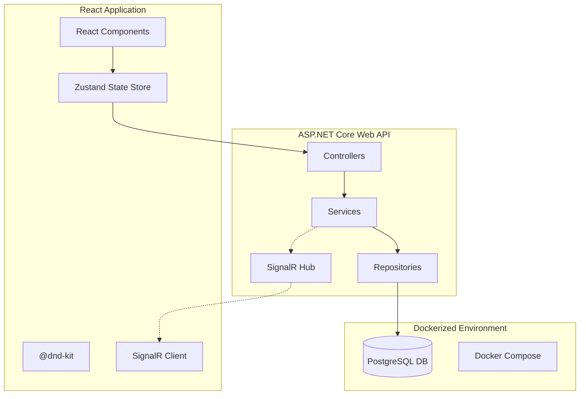

# Technical Deep Dive: VibeFlow Kanban Board

This document provides a detailed breakdown of the system architecture, component interactions, and the specific role of AI in the development lifecycle.

---

## 🏗️ System Architecture

The application follows a **Decoupled Client-Server Architecture** with real-time synchronization capabilities.



---

## 🔌 Component Interaction Flow (End-to-End)

When a user **moves a task** from "Backlog" to "In Progress":

1.  **Frontend UX:** `@dnd-kit` updates the UI locally for immediate feedback (optimistic UI).
2.  **API Call:** The `taskStore` calls `POST /api/tasks/{id}/move` with the new column and order.
3.  **Backend Logic:**
    *   `TasksController` receives the request.
    *   `TaskService` validates the move and updates the task status.
    *   `TaskRepository` persists the change to **PostgreSQL**.
4.  **Real-Time Broadcast:**
    *   `TaskService` triggers a message to `TaskHub` (SignalR).
    *   `TaskHub` broadcasts `TaskMoved` to all connected clients.
5.  **State Sync:** Other users' browsers receive the `TaskMoved` event and update their Zustand store automatically.

---

## 🛠️ Technology Stack Rationale

| Technology | Role | Why Chosen? |
| :--- | :--- | :--- |
| **.NET 8** | Backend | High performance, robust type safety, and first-class SignalR support. |
| **React 18** | Frontend | Modern component-based architecture with a vast ecosystem for D&D. |
| **Zustand** | State Mgmt | Extremely low boilerplate compared to Redux, perfect for high-velocity AI development. |
| **SignalR** | Real-time | Abstracted WebSockets; handles auto-reconnect and group management natively. |
| **PostgreSQL** | Database | ACID compliant, industrial-grade relational database for task integrity. |
| **Docker** | Orchestration | Ensures parity between Dev, Test, and Presentation environments. |

---

## 🤖 AI Integration & Evolution

### Phase 1: RooCode (Initial Build)
*   **Method:** Prompt-based scaffolding using markdown "Personas" and "Boundaries."
*   **Result:** Rapid generation of 80% of the boilerplate (Models, DB Context, Basic UI).
*   **The Hallucination Factor:**
    *   **Context Fragmentation:** As the file count grew, the AI began "hallucinating" API endpoints that didn't exist or forgetting to register dependencies in `Program.cs`.
    *   **The Fix:** Transitioned to **Antigravity** for deep-context debugging.

### Phase 2: Antigravity (Refinement & Vibe Coding)
*   **Method:** Iterative refinement with a "Human-in-the-loop" feedback loop.
*   **Key Contributions:**
    *   **Docker Optimization:** Resolved the port mapping conflicts (Standardizing on `8085`).
    *   **SignalR Integration:** Implemented the broadcast logic to solve the "State Drift" problem found during polling.
    *   **JWT Debugging:** Fixed the XML Schema mapping issue that was breaking the `userId` extraction from tokens.

---

## 🔬 "The Hallucination" — A Technical Analysis

**The Incident:** During task assignment, the application would return a `500 Internal Server Error`.
*   **AI's Hallucination:** The AI (RooCode phase) assumed that `.NET` would automatically map the `sub` claim from a JWT to `ClaimTypes.NameIdentifier` without explicit configuration.
*   **The Reality:** ASP.NET Core maps standard JWT claims to long XML namespaces by default.
*   **The Manual Fix:** I directed the AI to clear the default claim mapping:
    ```csharp
    JwtSecurityTokenHandler.DefaultInboundClaimTypeMap.Clear();
    ```
*   **Key Learning:** AI is excellent at *logic*, but often fails at *environment-specific wiring*. This is where senior engineering oversight is mandatory.
